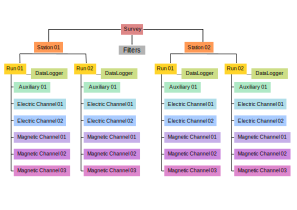
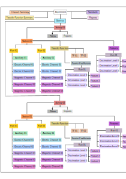

# MTH5

[](https://pypi.python.org/pypi/mth5)
[](https://anaconda.org/conda-forge/mth5)
[](https://code.chs.usgs.gov/jpeacock/mth5/-/new/master/LICENSE)
[](https://mth5.readthedocs.io/en/latest/?badge=latest)
[](https://codecov.io/gh/kujaku11/mth5)
[](https://zenodo.org/badge/latestdoi/283883448)
[](https://mybinder.org/v2/gh/kujaku11/mth5/master)

MTH5 is an HDF5-based data container for magnetotelluric time series data, with support for related products such as transfer functions and Fourier coefficients. The package provides tools to read, write, inspect, and manipulate MTH5 files.

MTH5 uses [h5py](https://www.h5py.org/) to interact with HDF5, [xarray](http://xarray.pydata.org/en/stable/) to work with indexed time-series data and metadata together, and [mt_metadata](https://github.com/kujaku11/mt_metadata) for metadata models.

This project is developed in cooperation with the Incorporated Research Institutions for Seismology, the U.S. Geological Survey, and other collaborators. Facilities of the IRIS Consortium are supported by the National Science Foundation's Seismological Facilities for the Advancement of Geoscience Award under Cooperative Support Agreement EAR-1851048. USGS support is provided in part through the Community for Data Integration and IMAGe through the Minerals Resources Program.

- Version: 0.6.5
- License: MIT
- Python: 3.10+
- API Documentation: https://mth5.readthedocs.io/
- Examples and how-to guides: https://iaga-dvi-datastandards.github.io/mth5_documentation.github.io/
- Notebook examples: https://github.com/IAGA-DVI-DataStandards/mth5_tutorial
- IAGA Division VI Data Standards Working Group: https://github.com/IAGA-DVI-DataStandards
- Suggested citation: Peacock, J. R., Kappler, K., Ronan, T., Heagy, L., Kelbert, A., Frassetto, A. (2022). MTH5: An archive and exchangeable data format for magnetotelluric time series data. *Computers & Geoscience*, 162. https://doi.org/10.1016/j.cageo.2022.105102

## Features

- Read and write HDF5 files formatted for magnetotelluric time series, transfer functions, and Fourier coefficients.
- Create an MTH5 file and add, retrieve, or remove surveys, stations, runs, channels, filters, transfer functions, and Fourier coefficients with their associated metadata.
- Store data in [xarray](http://xarray.pydata.org/en/stable/index.html) objects so data and metadata stay aligned and time-indexed.
- Read several input formats through companion I/O packages and plugins, including Z3D, NIMS BIN, USGS ASCII, LEMI, StationXML plus miniseed, Metronix (`atss` plus `json`), and Phoenix MTU5C.

## Installation

### Install from PyPI

```bash
python -m pip install mth5
```

### Install from conda-forge

```bash
conda config --add channels conda-forge
conda config --set channel_priority strict
conda install mth5
```

### Install from source

```bash
git clone https://github.com/kujaku11/mth5.git
cd mth5
python -m pip install -e .
```

For development dependencies:

```bash
python -m pip install -e .[dev,test]
```

## General Usage

The typical workflow is:

1. Open or create an MTH5 file.
2. Add a survey, then stations, runs, and channels.
3. Update metadata and write it back to the file.
4. Add derived products such as transfer functions or Fourier coefficients.
5. Reopen the file later for inspection, processing, or export.

Example:

```python
from mth5.mth5 import MTH5

with MTH5() as mth5_object:
    mth5_object.open_mth5("example_mth5.h5", "a")

    survey_group = mth5_object.add_survey("example")

    station_group = mth5_object.add_station("mt001", survey="example")
    station_group = survey_group.stations_group.add_station("mt002")
    station_group.metadata.location.latitude = "40:05:01"
    station_group.metadata.location.longitude = -122.3432
    station_group.metadata.location.elevation = 403.1
    station_group.metadata.acquired_by.author = "me"
    station_group.metadata.orientation.reference_frame = "geomagnetic"

    station_group.write_metadata()

    run_01 = mth5_object.add_run("mt002", "001", survey="example")
    station_group.add_run("002")

    mth5_object.add_channel(
        "mt002", "001", "ex", "electric", None, survey="example"
    )
    run_01.add_channel("hy", "magnetic", None)

    station_group.transfer_functions_group.add_transfer_function("tf01")
    station_group.fourier_coefficients_group.add_fc_group("fc01")

    print(mth5_object)
```

Additional resources:

- API documentation: https://mth5.readthedocs.io/
- Notebook examples: `docs/examples/notebooks`
- Broader examples and workflows: https://iaga-dvi-datastandards.github.io/mth5_documentation.github.io/

## Project Overview

### Introduction

The goal of MTH5 is to provide a self-describing hierarchical data format for working with, sharing, and archiving magnetotelluric data. The project was developed with community input and mirrors the way magnetotelluric data are collected and organized in practice.

The metadata model follows the standards proposed by the [IRIS-PASSCAL MT Software Working Group](https://www.iris.edu/hq/about_iris/governance/mt_soft) and documented in [MT Metadata Standards](https://doi.org/10.5066/P9AXGKEV).

### Code Structure

As the code base grew, some functionality was split into companion packages:

- [mt-timeseries](https://github.com/kujaku11/mt-timeseries) contains the `ChannelTS` and `RunTS` objects.
- [mt-io](https://github.com/kujaku11/mt-io) contains readers for supported source data formats and utilities for building `ChannelTS` and `RunTS` objects.

## MTH5 Format

The MTH5 hierarchy attaches metadata at each level of the file structure.

### MTH5 File Version 0.1.0



MTH5 file version **0.1.0** used `Survey` as the top-level group. That structure limited each file to a single survey. It remains relevant for archived files and historical reference, including datasets already stored in [ScienceBase](https://www.sciencebase.gov/catalog/) and files used by Aurora.

### MTH5 File Version 0.2.0



MTH5 file version **0.2.0** uses `Experiment` as the top-level group. This allows multiple surveys to coexist in a single file, which makes cross-survey workflows such as remote reference processing easier to manage.

MTH5 is comprehensively logged. If problems arise, check `mth5_debug.log` when debug mode is enabled in `mth5.__init__`, and `mth5_error.log` in your current working directory.

## Contributing

Contributions are welcome in the form of bug reports, feature requests, documentation improvements, and pull requests.

To start contributing:

1. Fork the repository.
2. Create a local clone.
3. Install the package in editable mode with development dependencies.
4. Create a feature branch.
5. Run formatting and tests before opening a pull request.

Typical local setup:

```bash
git clone https://github.com/your-username/mth5.git
cd mth5
python -m pip install -e .[dev,test]
pytest -n auto tests -k "not slow"
```

See `CONTRIBUTING.rst` for the full contribution workflow and project expectations.

## Raising Issues

Use the [GitHub issue tracker](https://github.com/kujaku11/mth5/issues) for:

- Bug reports
- Feature requests
- Documentation problems
- Questions about unexpected behavior

When opening an issue, include:

- Your operating system and Python version
- The MTH5 version you are using
- A minimal reproducible example or the exact steps to reproduce the problem
- Any relevant error messages, logs, or sample data details

## Credits

This project is developed in cooperation with the Incorporated Research Institutions for Seismology, the U.S. Geological Survey, and other collaborators. Facilities of the IRIS Consortium are supported by the National Science Foundation's Seismological Facilities for the Advancement of Geoscience Award under Cooperative Support Agreement EAR-1851048. USGS support is provided in part through the Community for Data Integration and IMAGe through the Minerals Resources Program.
