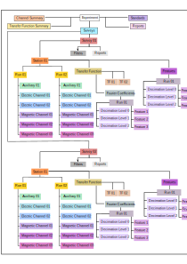

.. image:: https://img.shields.io/pypi/v/mth5.svg
    :target: https://pypi.python.org/pypi/mth5

.. image:: https://img.shields.io/conda/v/conda-forge/mth5.svg
    :target: https://anaconda.org/conda-forge/mth5

.. image:: https://img.shields.io/badge/License-MIT-yellow.svg
    :target: https://code.chs.usgs.gov/jpeacock/mth5/-/new/master/LICENSE

.. image:: https://readthedocs.org/projects/mth5/badge/?version=latest
    :target: https://mth5.readthedocs.io/en/latest/?badge=latest)
		
.. image:: https://codecov.io/gh/kujaku11/mth5/branch/master/graph/badge.svg?token=XU5QSRM1ZO
    :target: https://codecov.io/gh/kujaku11/mth5

.. image:: https://zenodo.org/badge/283883448.svg
    :target: https://zenodo.org/badge/latestdoi/283883448

.. image:: https://mybinder.org/badge_logo.svg
    :target: https://mybinder.org/v2/gh/kujaku11/mth5/master
	
MTH5
====

MTH5 is an HDF5 data container for magnetotelluric time series data, but could be extended to other data types.  This package provides tools for reading/writing/manipulating MTH5 files.

MTH5 uses `h5py <https://www.h5py.org/>`_ to interact with the HDF5 file, `xarray <http://xarray.pydata.org/en/stable/>`_ to interact with the data in a nice way, and all metadata use `mt_metadata <https://github.com/kujaku11/mt_metadata>`_. 

This project is in cooperation with the Incorporated Research Institutes of Seismology, the U.S. Geological Survey, and other collaborators.  Facilities of the IRIS Consortium are supported by the National Science Foundation’s Seismological Facilities for the Advancement of Geoscience (SAGE) Award under Cooperative Support Agreement EAR-1851048.  USGS is partially funded through the Community for Data Integration and IMAGe through the Minerals Resources Program.  

* **Version**: 0.5.1
* **Free software**: MIT license
* **Documentation**: `<https://mth5.readthedocs.io>`_.
* **Examples**: Click the `Binder` badge above and Jupyter Notebook examples are in **docs/examples/notebooks**
* **Suggested Citation**: Peacock, J. R., Kappler, K., Ronan, T., Heagy, L.,  Kelbert, A., Frassetto, A. (2022) MTH5: An archive and exchangeable data format for magnetotelluric time series data, *Computers & Geoscience*, **162**, doi:10.1016/j.cageo.2022.105102

Features
--------

* Read and write HDF5 files formated for magnetotelluric time series.
* From MTH5 a user can create an MTH5 file, get/add/remove stations, runs, channels and filters and all associated metadata.
* Data is contained as an `xarray <http://xarray.pydata.org/en/stable/index.html>`_ which can house the data and metadata together, and data is indexed by time.
* Readers for some data types are included as plugins, namely

	=============== =============
	Instrument      File Types   
	=============== =============
	NIMS            [.bin, .bnn] 
	LEMI424         [.txt]        
	USGS ASCII      [.asc, .gzip]
	Zonge ZEN       [.z3d]       
	Phoenix         [.td_*, .bin]
	miniseed        [.mseed]
	=============== =============

Introduction
-------------

The goal of **MTH5** is to provide a self describing heirarchical data format for working, sharing, and archiving.  **MTH5** was cooperatively developed with community input and follows logically how magnetotelluric data are collected.  This module provides open-source tools to interact with an **MTH5** file.  

The metadata follows the standards proposed by the `IRIS-PASSCAL MT Software working group <https://www.iris.edu/hq/about_iris/governance/mt_soft>`_ and
documented in `MT Metadata Standards <https://doi.org/10.5066/P9AXGKEV>`_
**Note**: If you would like to comment or contribute checkout `Issues <https://github.com/kujaku11/mth5/issues>`_ or `Slack <simpeg.slack.com>`_.   

MTH5 Format
-----------

-  The basic format of MTH5 is illustrated below, where metadata is attached at each level.

MTH5 File Version 0.1.0
------------------------

.. image:: source/images/example_mt_file_structure.svg
   
MTH5 file version **0.1.0** was the original file version where `Survey` was the highest level of the file.  This has some limitations in that only one `Survey` could be saved in a single file, but if you have mulitple `Surveys` that you would like to store we need to add a higher level `Experiment`.  

**Important**: Some MTH5 **0.1.0** files have already been archived on `ScienceBase <https://www.sciencebase.gov/catalog/>`_ and has been used as the working format for Aurora and is here for reference.  Moving forward the new format will be **0.2.0** as described below.
   
   
MTH5 File Version 0.2.0
-------------------------
   

   
MTH5 file version **0.2.0** has `Experiment` as the top level.  This allows for multiple `Surveys` to be included in a single file and therefore allows for more flexibility.  For example if you would like to remote reference stations in a local survey with stations from a different survey collected at the same time you can have all those surveys and stations in the same file and make it easier for processing.

.. hint:: MTH5 is comprehensively logged using `logugu`. If you want to log to a file just add a file handler to the logger. See `Loguru Documentation <https://loguru.readthedocs.io/en/stable/index.html>`_.

Examples
-----------

Make a simple MTH5 with one station, 2 runs, and 2 channels (version 0.2.0)

.. code-block:: python

	from mth5.mth5 import MTH5

	with MTH5() as mth5_object:
    	mth5_object.open_mth5(r"/home/mt/example_mth5.h5", "a")
    
    	# add a survey
    	survey_group = mth5_object.add_survey("example")
    
    	# add a station with metadata
    	station_group = mth5_object.add_station("mt001", survey="example")
    	station_group = survey_group.stations_group.add_station("mt002")
    	station_group.metadata.location.latitude = "40:05:01"
    	station_group.metadata.location.longitude = -122.3432
    	station_group.metadata.location.elevation = 403.1
    	station_group.metadata.acquired_by.author = "me"
    	station_group.metadata.orientation.reference_frame = "geomagnetic"
    
    	# IMPORTANT: Must always use the write_metadata method when metadata is updated.
    	station_group.write_metadata()
    
    	# add runs
    	run_01 = mth5_object.add_run("mt002", "001", survey="example")
    	run_02 = station_group.add_run("002")
    
    	# add channels
    	ex = mth5_object.add_channel("mt002", "001", "ex", "electric", None, survey="example")
    	hy = run_01.add_channel("hy", "magnetic", None)
    	
    	# add transfer functions
    	tf = station_group.transfer_functions_group.add_transfer_function("tf01")
    	
    	# add Fourier Coefficients
    	fcs = station_group.fourier_coefficients_group.add_fc_group("fc01")
    
    	print(mth5_object)
    
    	/:
        ====================
            |- Group: Experiment
            --------------------
                |- Group: Reports
                -----------------
                |- Group: Standards
                -------------------
                    --> Dataset: summary
                    ......................
                |- Group: Surveys
                -----------------
                    |- Group: example
                    -----------------
                        |- Group: Filters
                        -----------------
                            |- Group: coefficient
                            ---------------------
                            |- Group: fap
                            -------------
                            |- Group: fir
                            -------------
                            |- Group: time_delay
                            --------------------
                            |- Group: zpk
                            -------------
                        |- Group: Reports
                        -----------------
                        |- Group: Standards
                        -------------------
                            --> Dataset: summary
                            ......................
                        |- Group: Stations
                        ------------------
                            |- Group: mt001
                            ---------------
                                |- Group: Fourier_Coefficients
                                ------------------------------
                                |- Group: Transfer_Functions
                                ----------------------------
                            |- Group: mt002
                            ---------------
                                |- Group: 001
                                -------------
                                    --> Dataset: ex
                                    .................
                                    --> Dataset: hy
                                    .................
                                |- Group: 002
                                -------------
                                |- Group: Fourier_Coefficients
                                ------------------------------
                                    |- Group: fc01
                                    --------------
                                |- Group: Transfer_Functions
                                ----------------------------
                                    |- Group: tf01
                                    --------------
                --> Dataset: channel_summary
                ..............................
                --> Dataset: tf_summary
                .........................

Credits
-------

This project is in cooperation with the Incorporated Research Institutes of Seismology, the U.S. Geological Survey, and other collaborators.  Facilities of the IRIS Consortium are supported by the National Science Foundation’s Seismological Facilities for the Advancement of Geoscience (SAGE) Award under Cooperative Support Agreement EAR-1851048.  USGS is partially funded through the Community for Data Integration and IMAGe through the Minerals Resources Program. 
