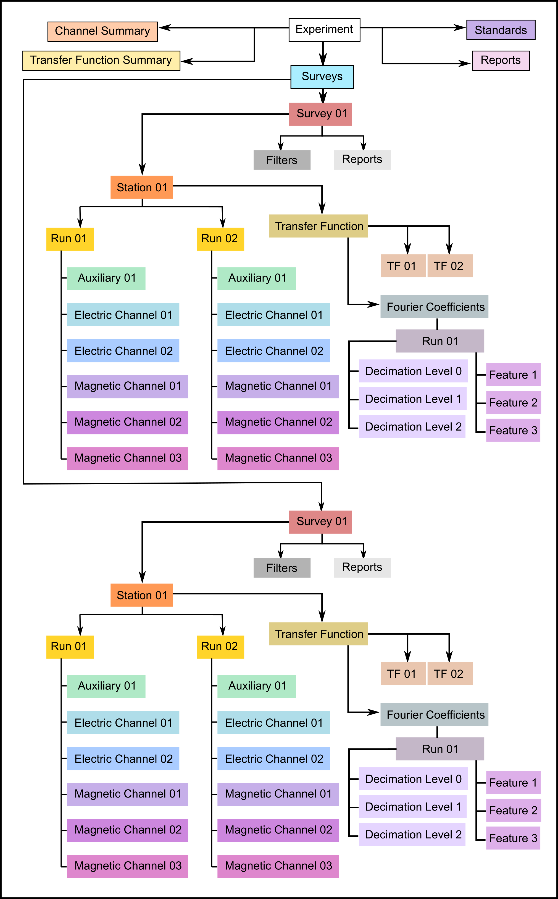

.. image:: source/images/mth5_logo.png
   :alt: MTH5 Logo
   :align: center

\

Introduction
-------------

The goal of **MTH5** is to provide a self describing heirarchical data format for working, sharing, and archiving.  **MTH5** was cooperatively developed with community input and follows logically how magnetotelluric data are collected.  This module provides open-source tools to interact with an **MTH5** file.  

The metadata follows the standards proposed by the `IRIS-PASSCAL MT
Software working
group <https://www.iris.edu/hq/about_iris/governance/mt_soft>`__ and
documented in `MT Metadata
Standards <https://doi.org/10.5066/P9AXGKEV>`__.

.. note:: If you would like to comment or contribute checkout `Issues <https://github.com/kujaku11/mth5/issues>`__ or `Slack <simpeg.slack.com>`__.   

MTH5 Format
-----------

-  The basic format of MTH5 is illustrated below, where metadata is
   attached at each level.

MTH5 File Version 0.1.0
~~~~~~~~~~~~~~~~~~~~~~~~

.. figure:: source/images/example_mt_file_structure.png
   :alt: MTH5 Format version 0.1.0
   :align: center

|
   
MTH5 file version **0.1.0** was the original file version where `Survey` was the highest level of the file.  This has some limitations in that only one `Survey` could be saved in a single file, but if you have mulitple `Surveys` that you would like to store we need to add a higher level `Experiment`.  

.. important:: Some MTH5 **0.1.0** files have already been archived on `ScienceBase <https://www.sciencebase.gov/catalog/>`__ and has been used as the working format for Aurora and is here for reference.  Moving forward the new format will be **0.2.0** as described below.
   
   
MTH5 File Version 0.2.0
~~~~~~~~~~~~~~~~~~~~~~~~
   

|
   
MTH5 file version **0.2.0** has `Experiment` as the top level.  This allows for multiple `Surveys` to be included in a single file and therefore allows for more flexibility.  For example if you would like to remote reference stations in a local survey with stations from a different survey collected at the same time you can have all those surveys and stations in the same file and make it easier for processing.

.. hint:: MTH5 is comprehensively logged, therefore if any problems arise you can always check the mth5_debug.log (if you are in debug mode, change the mode in the mth5.__init__) and the mth5_error.log, which will be written to your current working directory.
