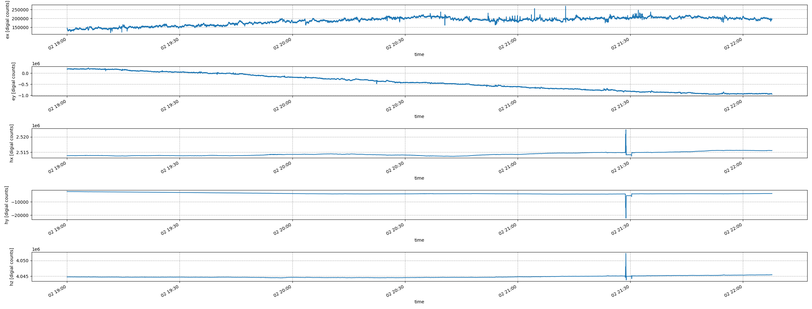
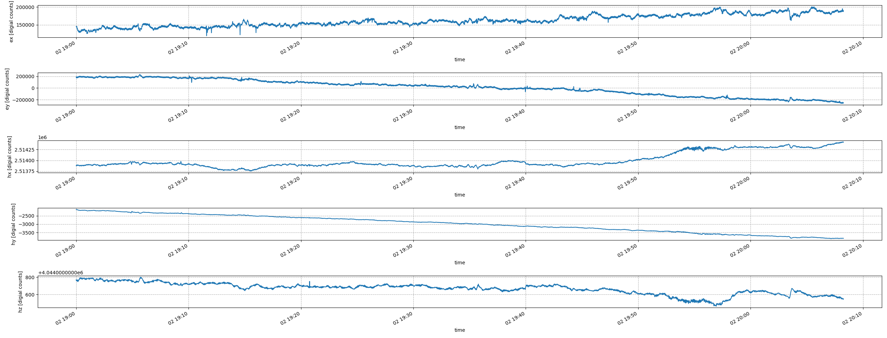

Interact with an MTH5 File
^^^^^^^^^^^^^^^^^^^^^^^^^^^^^^^^^^^^^^^^^^^^^^^^

Read in an MTH5
~~~~~~~~~~~~~~~~~~~

In the previous example we saw how to make an MTH5 from data at the IRIS DMC.  Now let's interogate that file and interact with it and looking at data.

First, read in the MTH5 file

.. code-block:: python

    from mth5.mth5 import MTH5
	
	m = MTH5()
	m.open_mth5("ZU_CAS04_NVR08.h5", "a")

Now lets gets some data v0.1.0

>>> run_a = m.get_run("CAS04", "a")

Now lets gets some data v0.2.0

>>> run_a = m.get_run("CAS04", "a", survey="ZU")

If there is not too much data we can plot this using matplotlib

>>> run_a.plot()
	

	
.. note:: If there is a lot of data, this will likely crash.  If you want to look at a window of data try the following

>>> run_a.plot(start="2020-06-02T19:00:00", n_samples=4096)

	
.. note:: Development of an efficient time series viewer using an MTH5 is in progress.  This will be based on PyViz tools and should make it easier to visualize the time series viewer.  Also, currently there are no tools to convert the time series into physical units.  This is also in development.

